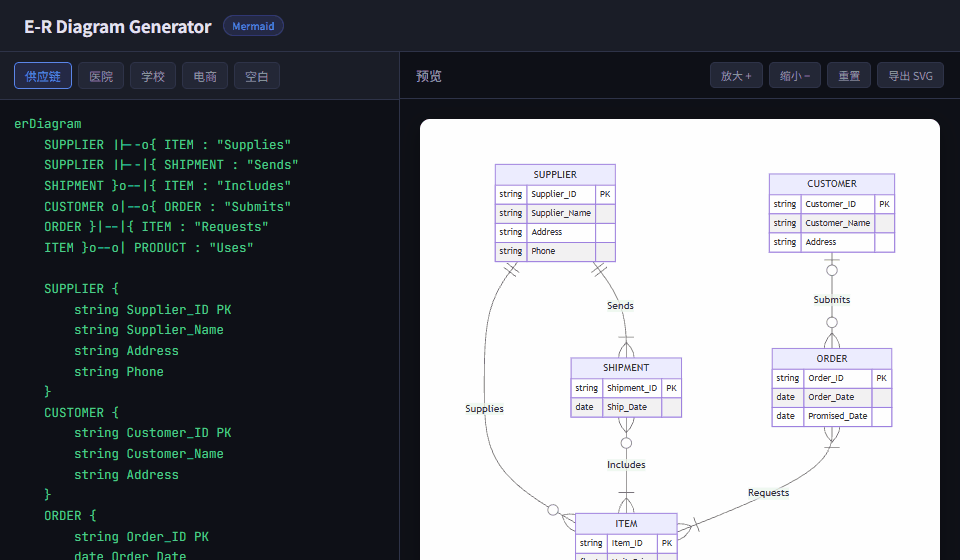
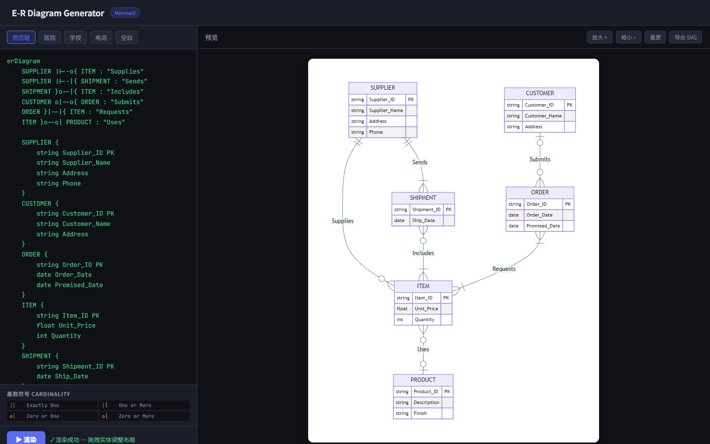
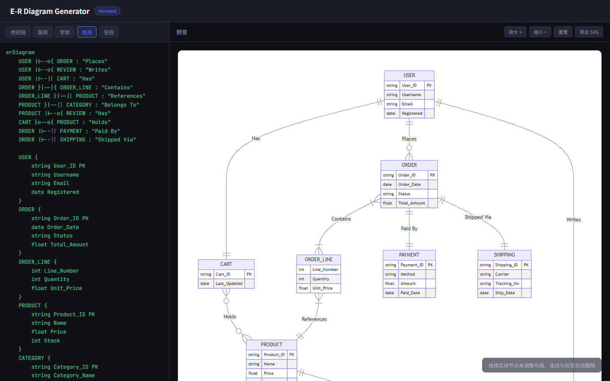
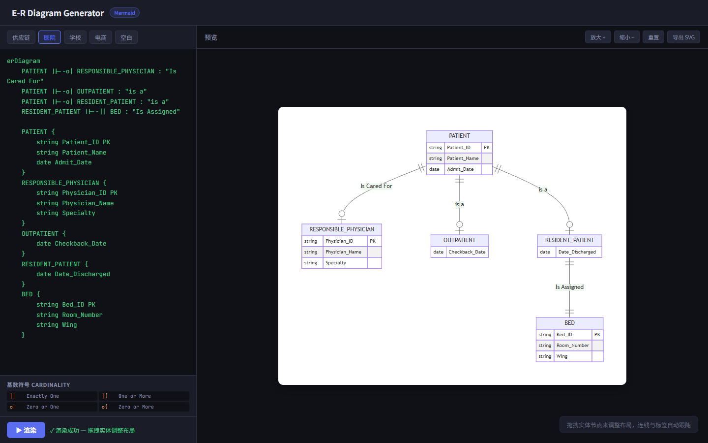

# E-R 图生成器

[English](README.md) | **中文**

> 零依赖、纯浏览器的 ER 图编辑器，由 [Mermaid.js](https://mermaid.js.org/) 驱动 —— 打开 `index.html` 即可使用，无需安装任何东西。



## 功能特性

- **实时渲染** — 编辑 Mermaid `erDiagram` 语法，按 `Ctrl+Enter`（或点击渲染按钮）即可即时预览
- **可拖拽实体** — 直接拖动实体节点调整布局，关系连线和标签自动跟随，采用智能四边路由算法
- **5 个内置模板** — 供应链、医院、学校、电商，以及空白起始模板
- **SVG 导出** — 一键导出高质量可缩放矢量图
- **缩放控制** — 预览区支持放大、缩小、重置
- **零安装** — 单个 `index.html` 文件，无需构建，无需服务器
- **基数符号速查** — 界面常驻 Mermaid 基数符号对照表

## 截图

### 供应链


### 电商


### 医院


## 快速开始

### 方式一 — 直接打开（最简单）
```
双击 index.html
```
完全离线可用，无需任何服务器。

### 方式二 — 本地 HTTP 服务器
```bash
# Python
python -m http.server 8080

# Node.js（npx）
npx serve .
```
然后在浏览器中打开 `http://localhost:8080`。

## 使用方法

1. **选择模板** — 从工具栏点击内置模板，或从"空白"开始
2. **编辑语法** — 在左侧面板编写标准 Mermaid `erDiagram` 语法
3. **按 `Ctrl+Enter`**（或点击渲染按钮）更新预览
4. **拖拽实体** — 在预览区拖动实体节点重新排列布局
5. **导出 SVG** — 点击预览区右上角的"导出 SVG"按钮

## 快捷键

| 快捷键 | 操作 |
|---|---|
| `Ctrl + Enter` | 渲染图表 |
| `Tab` | 在编辑器中插入 4 个空格缩进 |

## Mermaid erDiagram 语法速查

```
erDiagram
    实体A ||--o{ 实体B : "关系标签"
    实体A {
        string ID PK
        string Name
        date Created
    }
```

**基数符号：**

| 符号 | 含义 |
|---|---|
| `\|\|` | 恰好一个 |
| `o\|` | 零或一个 |
| `\|{` | 一个或多个 |
| `o{` | 零或多个 |

## 内置模板

| 模板 | 说明 |
|---|---|
| 供应链 | 供应商、客户、订单、商品、发货单、产品 |
| 医院 | 患者、主治医师、门诊患者、住院患者、床位 |
| 学校 | 学生、课程、教授、院系、成绩 |
| 电商 | 用户、订单、商品、购物车、支付、评价、物流 |
| 空白 | 包含两个示例实体的最简起始模板 |

## 技术栈

- **[Mermaid.js 10.6](https://mermaid.js.org/)** — 图表渲染引擎
- **原生 JS / CSS** — 无框架，无构建工具
- **JetBrains Mono + Noto Sans SC** — 通过 Google Fonts 加载

## 开源协议

MIT
